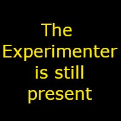

# Feature - Breakout Rooms

Open Video Lab provides breakout rooms so that the experimenter can talk privately with 
individual participants in order to answer questions or assist with connecting to
the video conference without disturbing the rest of the session.

In future this feature will be extended to allow for breakout rooms so that dyads or
groups of participants can communicate with each other directly. 

## Participant Guidance

At certain points during the experiment you may be put into a breakout room aside from
the main session.  

This will be the case when you first enter the session, so that you can ensure your video 
and audio is working properly with the video conferencing session without disturbing other
participants. 

If you have questions during the experiment or need individual assistance, the experimenter
may also move you into a breakout room to talk to you privately. 

When the experimenter is talking to another participant in a breakout room, you will see
a notice about this in place of the experimenter's video within the video conference. 

> [!NOTE] 
> While the experimenter is in a breakout room, please be aware they are still able to 
> see and monitor the main room of the session. 

## Experimenter Guidance

Breakout rooms are used to for you to privately communicate with participants: to answer 
questions and deal with any issues that arise with participants. They are also used
for initial onboarding of participants, and to allow experimenters to vet participants
when they first join to ensure eligibility as well as safeguarding of the other 
participants in the session.

### Creating Breakout Rooms

#### Automatic creation on participant joining

When participants first join the video conference, they will be automatically moved into 
a breakout room where they can test their microphone and camera using self-service advice. 
These rooms are created individually for each participant and are private so no
other participants are able to see or hear them whilst they are getting connected. 

#### Manual Creation

If at any point you need to talk to a participant individually, either to answer questions 
or for any other purpose, you can also manually create a breakout room and move them into it
using the interface via the 'admin report' in the oTree session admin interface. 

This interface provides a dropdown menu for creating a breakout room for an individual 
participant. When you select a participant from this dropdown and click create breakout
room, the room will be automatically created and the participant moved into the breakout
room.  A second conference window for the experimenter will also be created and that
extra conference instance will be moved into the breakout room with the experimenter.

While you are in the breakout room, your video and audio will be muted in the main room.  
However, you will still be able to see and monitor all participants in the main room of
the session.  The remaining participants will see a notice that you are assisting another 
participant in private but be informed that you are still able to see them, both for
ethical reasons and to discourage participants from leaving their computers and delaying
the session.

## Technical Details for Developers

Breakout rooms are handled directly within the jitsi software, via the integration javascript.

Communication between the dropdown room creation in the admin interface and the windows
running the actual conference happens via window.postMessage() messages.

### Files directly involved in handling breakout rooms

- open_video_lab/static/open_video_lab/8x8integration.js
- open_video_lab/static/open_video_lab/8x8popup.js
- open_video_lab/admin_report_content.js

### Development Backlog

- close room button also removes the room

### Testing (manual for now)

- room created when a participant first joins
  - if the participant has already been approved by an experimenter, the room is not created if they rejoin
- room is created if experimenter used the dropdown
  - an extra room is NOT created if it already exists
  - if participant is already in an existing room, extramenter should join them
  - if participant is not already in an existing room, they should be moved along with the extramenter
- close this room button achieves all the following:
  - closes the room, moving all participants into the main room
- video and audio muting of main experimenter room when Extramenter window is open
  - avatar image shows properly

