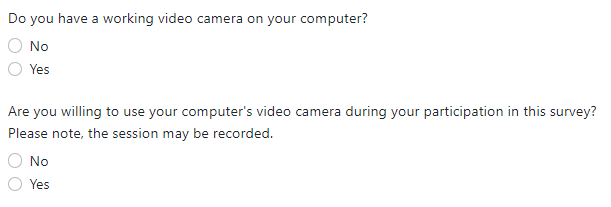
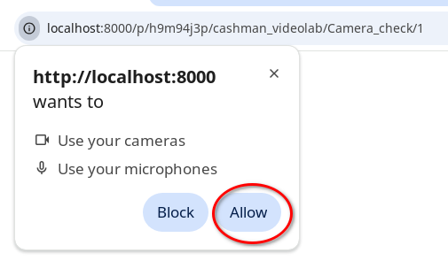
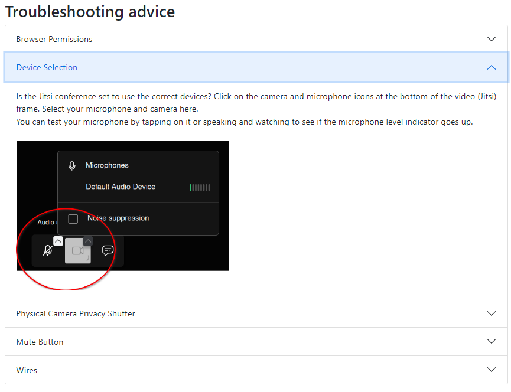
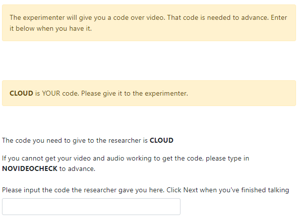
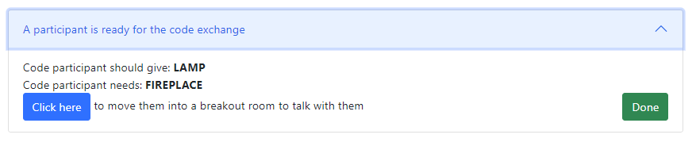
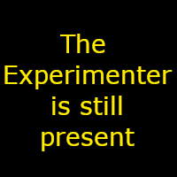

# Feature - Participant Onboarding (Code Exchange)

Behavioural Experiments with participant interaction conducted online are comparatively rare in the literature, and online participant pools have only recently started providing support for video conferencing labs. There are some technical steps necessary to assure the correct functioning of the technologies on participants' systems, as well as ethical obligations regarding the safeguarding of participants.  The Open Video Lab contains a participant onboarding flow designed to address these issues.

# Participant Documentation

When you first join an experiment featuring the Open Video Lab, you will need to consent to the use of a webcam and microphone and confirm that you have these devices on the computer you are joining the experiment from.  

This consent screen occurs before any the software attempt to connect you to a video conference, and if you do not wish to continue you can just close your browser window and withdraw from the experiment at this point.

Assuming you consent to continue, you will then be connected to an Open Video Lab instance for this experiment. The Open Video Lab will appear at the bottom of your screen, and attempt to connect you to the video conference for the experiment.  If this is the first time you have participated in an Open Video Lab (or you have previously only given permissions for one toime you), you should be prompted by your browser to allow access to your camera and microphone.  Please click "allow" on these prompts to continue with this experiment.

When you first join the experiment, you will be placed in a private breakout room for you to allow you to set up your equipment and await the experimenter to check you into the experiment. The software will ask you to confirm that these devices are functioning properly in your private breakout room, and provide some self-service troubleshooting tips if they are not.

If you are unable to get your camera, microphone and speakers working, or are unable to connect to the video conference at all, please use the [raise hand button](./docs/FEATURE_RAISE_HAND.md) to request assistance from the experimenter, who will attempt to help you as best they can.

To confirm that your microphone, camera and headphones/speakers are all working correctly, the Open Video Lab software will show you a random codeword for you to give to the experimenter and the experimenter will in return have a random codeword to give you.  You will need to successfully enter this codeword into a textbox on the screen to continue.  

Once you have successfully completed this step, you will be moved into the main room of the videoconference with the remaining participants to wait for the experimenter to finish checking in the remaining participants before the experiment continues.

# Experimenter Documentation

Because of potential differences in participants' setups and the technical elements involved, the Open Video Lab ecosystem contains an onboarding flow for ensuring that all participants have functioning cameras and microphones.  This flow involves the participants consenting to the use of cameras and microphones, connecting to the conference and having the opportunity to configure their setups in a private breakout room, and an individual meeting with an experimenter in this private breakout room for you to verify the technology is working correctly for the participant, check eligibility and exclude inappropriate participants before the remaining participants are exposed to them.

The majority of this procedure is self-service from the participants point of view, see the [participant documentation](# participant-documentation) for guidance on what their experience of this should be. The final stage - a private meeting in a breakout room to verify everything is working and vet participants for eligiblity - involves the experimenter. In this step, the participant is presented with a codeword to give you that allows you to verify the participant's microphone is working, and a codeword for you to reply to them with that will confirm the are able to hear you. Any further eligibility checks or vetting of inappropriate participants is left to the experimenter's individual discretion. 

When a participant confirms they are ready for this step, you will receive a new To Do item in your [Experimenter To Do list](./docs/FEATURE_EXPERIMENTER_TODO.md):

You can see in bold the word you should expect the participant to give you, and the word they need to enter in order to proceed. The participants are not able to proceed past this point in the study until they correctly enter this codeword in the box provided. Note that each of these words is randomly selected from a long list for each participant, so participants cannot collude to avoid this step. 

These entries in your To Do List appear in the order that participants reached this stage of the experiment, so it is recommended that you attend to them in the order presented. 

When you click on the "Join Participant in Breakout Room" button within the To Do List item, your 'Extramenter' instance of the video conference will be moved into that participant's Breakout Room.  If you do not currently have an Extrameneter instance open, a new one will be created for you.  While your Extramenter window is open, your video will be paused and your microphone muted in the main video conference to maintain privacy for the breakout room and avoid participant confusion, but the participants will be shown a notice to remind them that you are still present:

In the breakout room you can therefore communicate with the participant in private without the rest of the participants hearing.  You will need to ask the participant for their codeword and provide the response listed in the To Do item for them to enter in their view of the experiment.  

> [!TIP]
> If you have any additional eligibility checks to do, we recommend you complete these before the code exchange so that the participant does not have access to the rest of the experiment if they are not eligible.

Once you have completed eligibility checks and the code exchange, click the "Done" button in the To Do item, which will close and remove the breakout room, moving the participant into the main room for the experiment.

# Technical Documentation for Developers

To Follow
