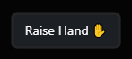
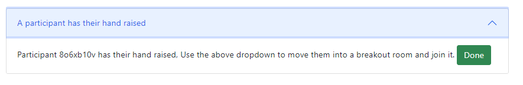

# Raise Hand Feature

Open Video Lab provides a raise hand feature that works across rooms and integrates with the Experimenter To Do List,
so that the experimenter will always be able to see which participants need assistance, even if they are in a breakout room.

## Participant Guidance

You can find the raise hand button in the bottom right corner of your screen.  

When you raise your hand, the experimenter will be alerted and will assist you as soon as they can. The button change
to indicate that your hand is raised:

If you no longer need assistance you can click this button again to lower your hand.  Otherwise, once the experimenter
has solved your problem, they can lower your hand for you.

Please bear in mind that the experimenter may have other participants to assist before you, so please be patient while you wait.

## Experimenter Guidance

Participants have the option to raise their hand if they have questions or issues that they require help with.  When
the participant raises their hand, an item will be added to your To Do List 

## Technical Details for Developers

The raise hand button is situated on the top level of the templates (i.e. not within the iframe).  

It communicates with the experiment via a custom websocket.

State of a participant's hand is tracked through participant.vars.ovl_hand_raised to persist through reloads.

> [!IMPORTANT]
> The custom websocket requires the experimenter to start the jitsi meeting before it will be live. (See [improvements backlog](#improvements-backlog)

### Improvements backlog

- automate the creation of the custom websocket endpoint
- integrate the raise/lower hand options with the participant list in jitsi
- show a 'push notification' for the experimenter (likely via a websocket onMessage listener) when a participant raises/lowers their hand
  - don't show it if the experimenter lowers the participant hand for them
- Show participant a notification when experimenter lowers their hand for them, and give them the option to keep it raised [like teams does](https://techcommunity.microsoft.com/t5/microsoft-teams-public-preview/now-in-public-preview-automatic-lowering-of-a-user-s-raised-hand/m-p/3753763)
  
### Tests (not yet automated - need manual checking)

#### Participant UI
  - Raise Hand Button changes to Lower Hand Button and vice versa
  - Button state on reload syncs with To Do List state
#### Integration with To Do List
  - Raise Hand Button creates an item on the To Do List via live method
  - Lower Hand Button removes an item on  the To Do List via live method
  - Existing raised hands persist through reload
  - Experimenter view "Done" button lowers participant's hand for them and removes from the To Do List
      - when the item has been added by the live method
      - when the item has been present since page load
